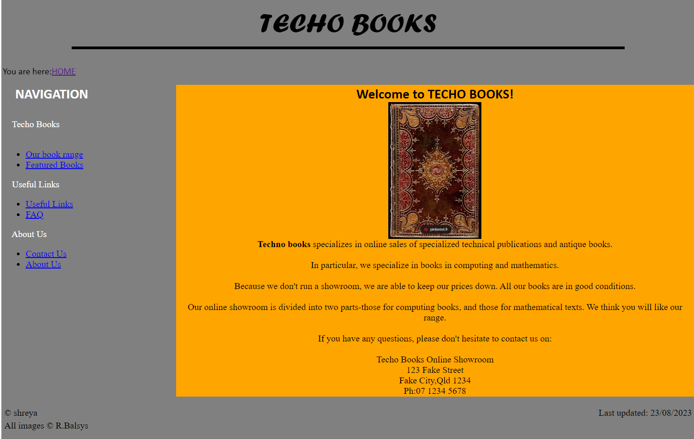

# Techo Books Website Development

## Overview

This project involves developing a simple website for a fictitious business called **Techo Books**. The website is designed to showcase a variety of books on mathematics and computing, as well as a selection of rare and hard-to-get technical books. The development will be carried out using XHTML and CSS.

## Objectives

The main objectives of this assignment are to:
- Develop static web pages using appropriate technology.
- Familiarize with key components of a typical web-based application.
- Understand the terminology used in web development.
- Explore various uses of websites.

## Pages to be Developed

1. **index.html**: Home page with an introduction to the store.
2. **book.html**: Displays the range of books for sale.
3. **featured.html**: Lists featured books that are rare or hard to get.
4. **usefullinks.html**: Contains useful links for prospective buyers.
5. **faq.html**: Answers questions related to the COIS21001 course.
6. **contact.html**: Lists contact information for Techo Books.
7. **about.html**: Provides details about the Techo Books business.
8. **a1site.css**: Stylesheet for the entire website.

## Development Guidelines

- Use a simple editor like WordPad or Notepad. Avoid FrontPage or DreamWeaver.
- Ensure the website has a consistent look and feel using a CSS stylesheet.
- Follow proper XHTML conventions, including the DOCTYPE declaration.
- Store all images in the `images` directory and all popup HTML files in the `popuphtml` directory.

## Layout and Functionality

All pages should follow a specific layout structure involving a header, breadcrumb navigation, menu, content, footer, and additional informational divs. Specific details for each section and page are as follows:

### Header

- Contains the logo image (`images/headerlogo.jpg`), hyperlinked to the home page.
- Logo must scale to the width of the page with a fixed height of 100px.

### Menu

- Contains navigation links to all the pages.
- Links must open in the same window.

### Breadcrumb

- Shows the user’s location in the website with hyperlinks to previous pages.

### Content

- Contains the main content of each page.
- Includes a "Top" hyperlink to navigate to the top of the page.

### Footer

- Includes copyright information and last update date.

### Specific Pages

#### Home Page (index.html)

- Displays a welcome message and an image (`images/vitalogy-1-sm.jpg`).
- 

#### Book Range (book.html)

- Shows a table of books with images, titles, and prices.
- Images should have `alt` and `title` attributes for accessibility and hover information.

#### Featured Books (featured.html)

- Displays a table of featured books with images and details.
- Thumbnails are hyperlinked to popup HTML pages.

#### Useful Links (usefullinks.html)

- Contains hyperlinks to useful external websites.

#### FAQ (faq.html)

- Answers specific course-related questions.
- Properly formatted and referenced answers.

#### Contact (contact.html)

- Lists contact methods in an ordered list.
- Email link should use the `mailto` attribute.

#### About (about.html)

- Provides detailed information about Techo Books.

©Shreya  
All images © R. Balsys.
